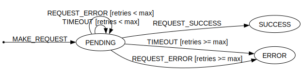

# REQUEST State Machine

## Basic request example

- Retries on error or timeout
- ERROR on max retries/timeouts reached

Demonstrates basic and most useful functionality of **Active Object** with **FSM**. 

FSM transitions presented in a compact & readable way - **Transitions table**. Implementing [Mealy machine](https://en.wikipedia.org/wiki/Mealy_machine) with **guards** functionality for max retries.   