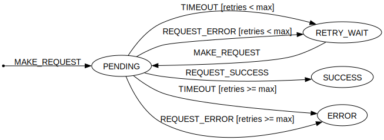

# REQUEST with Retry State Machine

## Request with delayed retry example

- Performs Retry on error or timeout after delay
- ERROR on max retries/timeouts reached

FSM transitions presented in a compact & readable way - **Transitions table**. Implementing [Mealy machine](https://en.wikipedia.org/wiki/Mealy_machine) with **guards** functionality for max retries.   