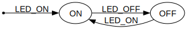

# BLINKY State Machine

## Simple blinking LED on/off

- LED_ON doesn't restart timing cycle
- Idle (sleep) between LED flashing

Basic **Active Object** functionality demonstration. Only `active-object.h` + `queue.h` modules utilized. Demonstrates library modularity - switch/case state machine implemented directly in `main.c`.